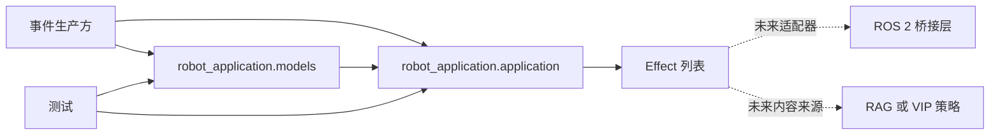

# 架构设计

## 模块图与依赖方向

`models` 保存不可变的公共数据契约。`application` 依赖这些契约，并拥有全部业务状态。测试只使用公共构造函数、`handle_event()` 和 `snapshot()`。

图中的虚线组件是未来扩展点，不是当前已经实现的依赖。

## 模块职责

### `robot_application.models`

- 按题目指定的导入路径定义 `Event` 和 `Effect`。
- 不包含业务决策或可变状态。

### `robot_application.application`

- 按事件到达顺序处理事件。
- 负责接待过程去重、待确认离场时间、对话状态和会议状态。
- 只返回当前事件新产生的效果。
- 不调用 ROS 2、相机、硬件、数据库或网络服务。

### `tests`

- 通过公共接口验证可观察行为。
- 直接使用题目事件中的时间戳，因此不需要等待真实时间。

## 状态归属

| 状态 | 归属 | 用途 |
|---|---|---|
| `reception_active` | `RobotApplication` | 标识一次连续在场的接待过程，避免重复迎宾。 |
| `absence_started_at` | `RobotApplication` | 记录可能开始离场的时间；由 `TICK` 在超时后确认离场。 |
| `conversation_active` | `RobotApplication` | 对话进行期间抑制效果。 |
| `meeting_active` | `RobotApplication` | 会议进行期间抑制效果，并且与对话状态相互独立。 |

离场计时在忙碌状态下到达阈值时，应用会确认离场但不产生效果。这是为了满足题目“结束后也不补发”的要求。

当前题目描述的是一个迎宾区域内连续的一次在场接待过程。`person_id` 保留在公共事件契约中，但当前实现不自行增加题目未定义的多人交互策略。

## Effect 契约

- 空闲状态下开始新接待：产生 `ROBOT_ACTION/wave_hand` 和 `SPEECH/欢迎光临`。
- 空闲状态下确认离场：产生 `SPEECH/感谢光临，欢迎下次再来`。

题目明确规定了 `wave_hand` 和欢迎语，但没有规定语音的 `effect_type` 和送客语原文。因此这里明确选用上述值，并由测试固定其行为。

## 未来扩展

应用继续负责接待决策并输出 Effect，新增能力放在应用边界之外：

- VIP：由小型问候策略根据人员信息选择效果内容，不在事件处理逻辑中查询人员资料。
- RAG：在独立的内容服务或 Effect 适配层中生成更丰富的语音内容，使检索失败不影响在场状态。
- ROS 2 导航或动作：由桥接模块消费 `Effect` 并转换为 ROS 2 动作；业务模块不导入 ROS 2。

只在需求明确提出时才引入这些接口。当前实现有意保持为一个小型应用类和两个数据模型，避免过度设计。
